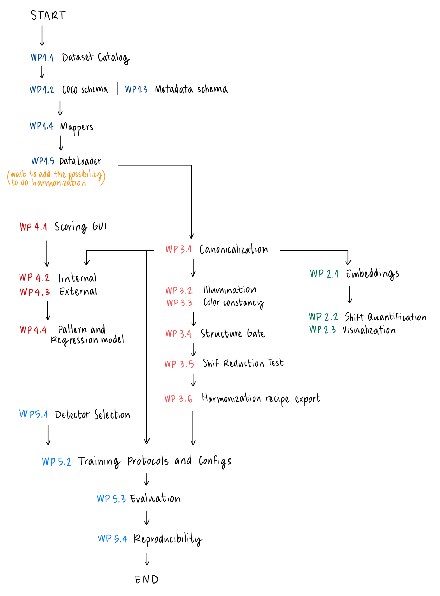

# PolypHUB-Polyps-Data-Harmonization

cat > README.md << 'EOF'
# PolypHUB - Polyps Data Harmonization

## 🚧 Work in Progress

This repository is currently under development and will serve as the public version of our polyp detection and data harmonization project.

## Project Process

## 📂 Repository Structure

- **docs/** - Project documentation
- **polyphub/** - Core package with data management and embeddings tools
- **templates/** - Issue and PR templates

## ⚠️ Status

This is a preliminary version created for review purposes. The complete repository will be made public upon project completion.

---
